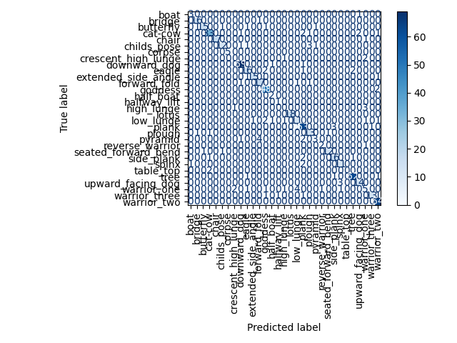

# Yoga Pose Accuracy Detector

This project uses **MediaPipe** and **OpenCV** to detect human pose landmarks from images or webcam input. It is designed to help identify and visualize yoga poses in real time using machine learning classification.

---

## 🔧 Setup Instructions (Virtual Environment)

### 1. Clone the Repository

```bash
git clone https://github.com/your-username/yoga-pose-accuracy-detector.git
cd yoga-pose-accuracy-detector
```

### 2. Create and Activate a Virtual Environment
#### MacOS: 
```bash
python3.10 -m venv mp-env
source mp-env/bin/activate
```

#### Windows
```bash
python -m venv mp-env
mp-env\Scripts\activate
```

### 3. Install Dependencies 
```bash
make install
```

#### Required Libraries:
- **mediapipe** - Pose detection and landmark extraction
- **opencv-python** - Computer vision and image processing
- **matplotlib** - Data visualization and plotting
- **scikit-learn** - Machine learning algorithms (KNN classifier, preprocessing)
- **seaborn** - Statistical data visualization
- **joblib** - Model serialization and loading
- **Pillow** - Image processing and format conversion
- **pandas** - Data manipulation and CSV handling
- **numpy** - Numerical computing and array operations

### 4. Running Scripts 
```bash
make prepare   # Load training data and build CSV datasets
make train     # Train the KNN model (runs prepare first if needed)
make test      # Run live webcam detection (press 'q' to quit)
make clean     # Remove generated files and caches
```

## 📁 Project Structure

- **src/** - Source code files
- **data/** - JSON files with pose landmark data
- **training-data/** - Training images organized by pose type
- **models/** - Trained model files
- **pose_dataset.csv** - Raw landmark coordinates
- **pose_angles_dataset.csv** - Processed angle features

---

## 🧠 Model & Training
We use a K-Nearest Neighbors (KNN) classifier trained on pose-angle features derived from MediaPipe landmarks. Each image/frame is converted into a compact vector of body-relative joint angles (e.g., elbows, knees, hips, shoulders, spine). Angles make the model more robust to scale and camera position than raw coordinates.

**Model pipeline**
- MinMaxScaler – normalizes all angle features into the [0, 1] range
- KNeighborsClassifier – predicts the pose class based on the nearest labeled examples in this feature space

**🔍 Hyperparameter Search (with 3-Fold Cross-Validation)**
We use GridSearchCV with 3-fold cross-validation to select optimal KNN settings.
The search space includes:
- n_neighbors: 1–7
- metric: euclidean, manhattan, minkowski
- weights: uniform, distance

**How the 3-fold CV works (brief)**
After a 75% train / 25% test split (stratified by pose), the training portion is divided into 3 folds (A, B, C). Cross-validation loop (for each hyperparameter combo):
- Round 1: Train on Folds B + C, validate on Fold A
- Round 2: Train on Folds A + C, validate on Fold B
- Round 3: Train on Folds A + B, validate on Fold C
- Record the validation accuracy for each round and compute the mean validation score.
- GridSearchCV selects the configuration with the highest mean validation score.

Best parameters found:
- n_neighbors = 4
- metric = manhattan
- weights = distance

## **📂 Training Procedure**
1. Dataset construction
- pose_dataset.csv → raw MediaPipe landmarks
- pose_angles_dataset.csv → engineered joint-angle features + pose labels

2. Train/test split
- 75% train / 25% test, stratified by label

3. Hyperparameter tuning
- GridSearchCV (3-fold CV) selects the best KNN settings

4. Final training & evaluation
- Retrain best model on the full training set
- Evaluate on the 25% held-out test set
- Report classification metrics and confusion matrix

5. Runtime bundle export
- Save pose_knn_runtime.pkl containing:
- scaler
- trained knn
- label_encoder
- feature_names

### Evaluation Example
#### Results
```text
                     precision    recall  f1-score   support

               boat      0.750     0.750     0.750         4
             bridge      0.889     0.941     0.914        17
          butterfly      0.938     0.750     0.833        20
            cat-cow      0.892     0.825     0.857        40
              chair      1.000     0.944     0.971        18
        childs_pose      0.857     0.667     0.750        18
             corpse      1.000     1.000     1.000         5
crescent_high_lunge      0.000     0.000     0.000         3
       downward_dog      0.945     0.972     0.958        71
              eagle      0.762     0.762     0.762        21
extended_side_angle      0.938     0.882     0.909        17
       forward_fold      0.773     0.850     0.810        20
            goddess      0.873     0.960     0.914        50
          half_boat      0.500     1.000     0.667         2
       halfway_lift      0.500     1.000     0.667         1
         high_lunge      0.000     0.000     0.000         4
              lotus      1.000     1.000     1.000        18
          low_lunge      0.647     0.611     0.629        18
              plank      0.851     0.926     0.887        68
             plough      0.722     0.812     0.765        16
            pyramid      0.600     0.300     0.400        10
    reverse_warrior      0.667     0.667     0.667         3
seated_forward_bend      0.923     0.857     0.889        14
         side_plank      0.800     0.800     0.800        20
              spinx      0.733     0.786     0.759        14
          table_top      0.000     0.000     0.000         2
               tree      0.954     0.954     0.954        65
  upward_facing_dog      0.824     0.824     0.824        17
        warrior_one      0.385     0.312     0.345        16
      warrior_three      0.929     0.765     0.839        17
        warrior_two      0.901     1.000     0.948        64

           accuracy                          0.856       673
          macro avg      0.727     0.739     0.725       673
       weighted avg      0.851     0.856     0.850       673
``` 
#### Confusion Matrix


---

## 🧘‍♀️ Supported Poses

The model can classify various yoga poses based on the training data in your `training-data/` folder.

---

## 📊 Data Sources & Credits

This project uses publicly available datasets and reference images for training and evaluation:

- [Yoga Posture Dataset (Kaggle, Mrinal Tyagi)](https://www.kaggle.com/datasets/tr1gg3rtrash/yoga-posture-dataset/data?select=Adho+Mukha+Svanasana)  
- [Yoga Poses Dataset (Kaggle, by Niharika Pandit)](https://www.kaggle.com/datasets/niharika41298/yoga-poses-dataset/data)  
- [Yoga With Adriene YouTube Channel](https://www.youtube.com/user/yogawithadriene) — select reference images used to supplement training data.

All credit goes to the original dataset creators and Yoga With Adriene.  
This project is for **educational and research purposes only** and not intended for commercial use.

